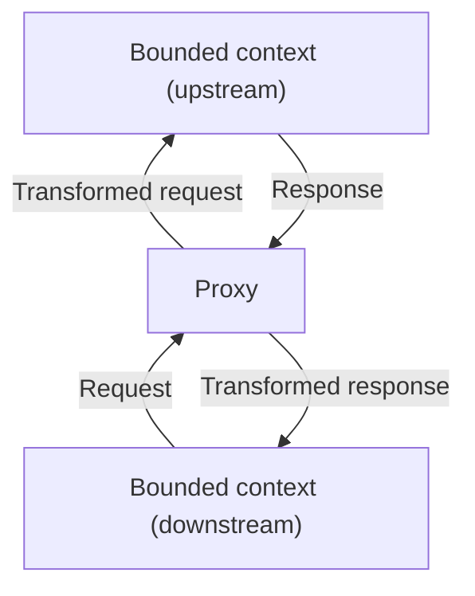
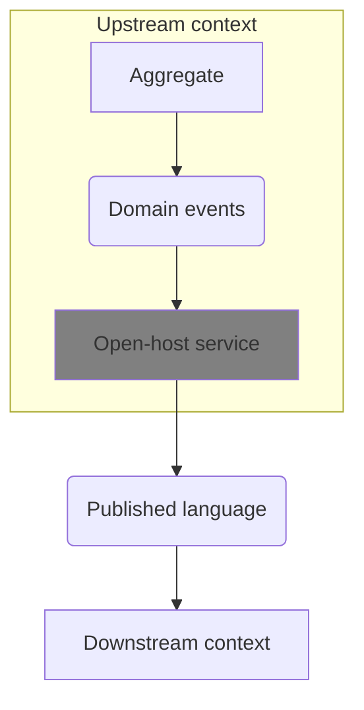
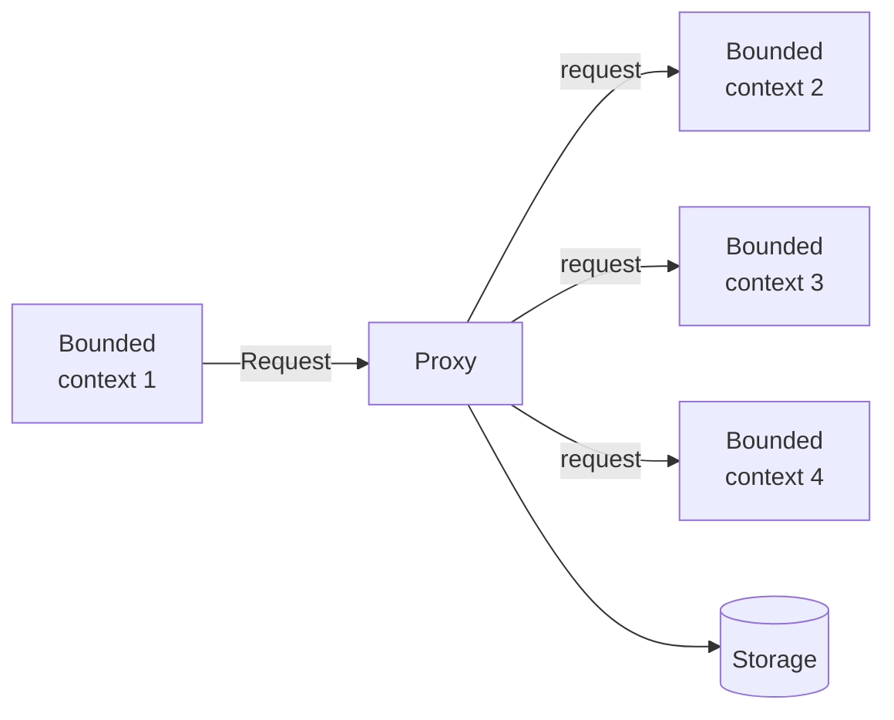
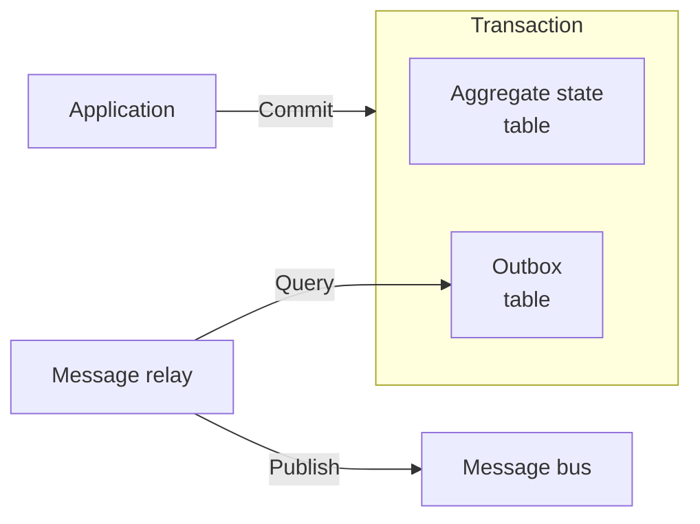

# Learning Domain-Driven Design / ドメイン駆動設計をはじめよう

## 1. ビジネスドメインを分析する

ビジネスドメインとは、**会社の主たる活動領域**のこと。複数の場合もある。
例えば、Fedexなら運送、スタバなら飲食、ウォルマートなら小売。

ドメインの目標を達成するために、複数の**サブドメイン**が構成される。
例えば、スタバならコーヒー製造、物流、不動産、人事、金融など。

サブドメインは、Core, Generic, and Supporting の3種類がある。

- **Core Subdomains**
  - ビジネス固有かつ複雑な領域
  - 金を生む
  - 競争力になる
  - 他社に対する参入障壁として機能する
  - 頻繁に変更される
  - 技術によるものとは限らず、人によるものの場合もある
  - e.g. 宝石屋ならデザイン部門
- **Generic Subdomains**
  - ビジネス固有ではないが複雑な領域
  - ビジネス固有ではないので、既成のソリューションがあり、競争力にはならない
  - "Known unknowns"の領域
  - e.g. ユーザーの認証システムなど
- **Supporting Subdomains**
  - ビジネス固有かつシンプルな領域
  - ビジネス固有なので、既製品はない
  - シンプルなので、競争力にはならない
  - リソースを割いてもしょうがない領域であり、アウトソース候補である
  - ETLやCRUDのようなインターフェースを取ることが多い

サブドメインの発見は、ユースケースを基準に行うとよい。
特定のアクターが、一定の範囲のデータとそれに対応するユースケース群を使って、
業務フローを完結できる単位が、一つのサブドメインと言える。

**ドメインエキスパート**とは、ビジネスルールとプロセスを知っている人のこと。
ソフトウェアで問題を解決してあげる対象者であり、エンドユーザーともいえる。

## 2. ドメイン知識を発見する

### 問題

ビジネスにおける**問題**とは、簡単に解けるクイズのようなものではなく、
もっと幅広い意味を持つものだ。例えば以下のようなものがある。

- 非効率なワークフロー
- 人の手がかかる高コスト作業
- リソースの非効率的な分配
- 意思決定のための情報の不足
- 大量のデータの管理

これらの問題にソリューションを提供するのが、ビジネスの目的である。
コードを書くという作業は枝葉の話である。成功に必要なのは**問題の理解**である。

### ユビキタス言語

従来、問題からソリューションまでの道は「ドメイン知識->分析モデル->仕様->システム設計->実装」のような流れだった。
これは**一方通行的**であり、開発者と現場の相互の意見交換がないので、問題理解が浅いままになりがち。
また、多くの**変換**の過程で情報が失われたり陳腐化したりする。
結果として的はずれな解決策が生まれる。

それよりも、あらゆる関係者が**ユビキタス言語**を使うべきだ。

ユビキタス言語とは、ドメインエキスパートのビジネスドメインに対する理解とメンタルモデルを、
**技術の言葉ではなくビジネスの言葉で表現**したものである。
あらゆる関係者がユビキタス言語を使えば、問題理解が促進され、変換も不要になる。

ユビキタス言語は全ての関係者が使うべきだし、
あらゆる場所（会話、文書、テスト、図、コード）で使うべきである。
これを守るのが一番大事で、忍耐と監視が必要。

1つの言葉は1つの概念をきっちり表すものでなければならない。
曖昧な言葉は、より具体的な複数の定義に分けよう。
似たような言葉は、コンテキストを意識して明確に使い分けるか、もしくは統合しよう。

### モデル

**モデル**とは現実世界の要素を簡略化・抽象化して表現したもの。
モデルは特定の目的や問題解決(≒システム)のために作られる。

なので、モデルが単に現実世界のコピーになってはダメであり、
目的達成のために必要となる情報を過不足なく得られるよう、
現実世界の要素を取捨選択しながら作る必要がある。
例えば地図でいうと、目的に応じて世界地図、電車路線図、測量図など様々なモデルがあるように。

ユビキタス言語は、**ドメインエキスパートのメンタルモデルを捉えるためのモデル**といえる。

ユビキタス言語は継続的に進化していくべきものであり、ツールの活用は大事。
「名詞」の管理、つまり用語集をつくるにはwikiを使うと良い。英語の定義は必須で、必要に応じて他言語でも定義する。
「動詞」の管理、つまりシナリオの管理には[Gherkin](https://cucumber.io/docs/gherkin/reference/)を書いて管理すると良い。

```gherkin
Feature: 書籍の貸出
  図書館員が利用者に書籍を貸し出すことができる

    Background:
      Given 図書館システムが稼働している

    Scenario: 通常の貸出
      Given 会員 "山田" の貸出冊数が 2冊
      And 書籍 "吾輩は猫である" が貸出可能
      When 山田に貸し出す
      Then 貸出が完了する
      And 山田の貸出冊数が 3冊になる
      And 書籍が "貸出中" になる

    Scenario: 貸出上限エラー
      Given 会員 "鈴木" の貸出冊数が 5冊（上限）
      And 書籍 "坊っちゃん" が貸出可能
      When 鈴木に貸し出そうとする
      Then "貸出上限に達しています" とエラーになる
      And 貸出冊数は変わらない
```

大事な知識はドメインエキスパートの頭の中にしかなかったりするので、モデルを作るのは厳しい道だ。
とにかく質問をする以外に近道はない。これは発見というよりは共創のプロセスであるとみんなで認識しよう。

## 3. ドメインの複雑さと戦う

### Bounded Contexts とモデル

ビジネスが大きくなると、同じ言葉がコンテキストによって違う意味を持つ場合がある。
あらゆる場所で使える巨大な言葉を定義したり、言葉にプレフィックスを付けたりする解決法もあるが、うまくいかないことが多い。

こういうときは **Bounded Contexts** を作る。

実は、モデル(=ユビキタス言語、つまり語彙や原理やビジネスルール)はBounded Contextの中にしか存在し得ない。
特定の問題を解決するために境界を作り、その目的を意識しながらドメインをモデル化することで、初めてモデルは意味を持つ。
境界がなければモデルはただの現実世界の完全コピーになってしまい、なんの役にもたたない代物になる。

「ユビキタス」とは、あくまで社内のあらゆる場所で使われるべきという意味であり、
どんなコンテキストでも使える「ユニバーサル」という意味ではないのだ。

Bounded Context が現実世界のどこに存在するかというと、ドメインエキスパートの心の中である(!)。

### サブドメインとBounded Contexts

サブドメインは**発見**するものである。企業の戦略で決まり、開発者の範疇の外にある。

一方、Bounded Context(これはユビキタス言語というモデルのスコープでもある)は、**デザイン**するものである。
戦略的な判断により適切に決める。

Contextは必ずしもサブドメインと**1-1で結びつかなくてもいい**。
小さいシステムなら全てのサブドメインを一つのContextで対処することもできる。
もしモデルがコンフリクトするようであれば、コンテキストを分割していくべきだろう。
また、ある1つのサブドメインにおいて問題のバリエーションが多い場合は、
1つのサブドメインに対して複数のContextを同時に割り当てることもある。

Contextの範囲は小さいほうがモデルの一貫性を保ちやすく、管理しやしく、スケールアウトしやすい。
一方で、同じデータを扱うユースケースが複数のContextに分断されると効率が落ちる。

### 境界の役割

アーキテクチャデザインとは、つまるところ境界を決めることである。
何が含まれ、何が除外され、何が境界を跨ぎ、何がその間を行き来するかを明らかにすることだ。

Bounded Context は**物理境界**である。
つまり、独自に進化が可能で、コード・デプロイ・バージョン管理などは完全に独立している。
service, subsystem といった手法で分離される。

Bounded Contextは **所有境界** でもある。
1つのチームだけで管理されるべきであり、2つ以上のチームで共有はできない。

Bounded Context の中に複数のサブドメインが含まれる場合、
それらサブドメイン間の境界は**論理境界**となる。
namespace, module, package といった手法で分離される。

## 4. Bounded Context を組み合わせる

複数のBounded Contextsの間でのコミュニケーションにおける、
取り決めや約束事を **Contracts** と呼ぶ。
そのスタイルにはいくつかの種類がある。

### Cooperation

1つのチームが複数のContextを管理していたり、2つのチームが共通のゴールを共有しており、
密なコミュニケーションがとれる場合には、Cooperationが選択できる。

**Partnership**は、APIに変更があったときにチーム間で連絡し合って、都度調整する方法。
素朴でシンプルだが、チーム間で極めて頻繁かつ同期的なコミュニケーションが必要である。

**Shared Kernel**は、複数のContextで同じモデルを使用すること。
コードが重複することの弊害が、コードを共有することで発生する調整コストよりも大きい場合に使用を検討する。
変更を加えたら自動でCIが実行され、即時に全てのContextに反映されるようにする。
影響を小さくするため、モデル化の範囲は必要最小限とすべき。
代表的なユースケースとしては以下がある。

- 地理的に離れたチームなのでPartnershipを採用できないとき
- レガシーシステムの近代化の過程での一時的な構成として
- 単一チームで複数のContextを扱うときに、あえて境界を明確化するため (単一チームでPartnershipを採用すると境界が曖昧になりがち)

### Customer-Supplier

Upstream(supplier)とDownstream(customer)を定義し、
それぞれ独立して開発できるようにする方法。
パワーバランスに差があるのが特徴。

**Comformist**は、upstreamが決めた形式にdownstreamが適合(Conform)する方法。
外部サービスを利用する場合などに取るパターン。
upstream側が業界標準形式のデータを提供していたり、
洗練されたモデルを提供していて、それをそのまま使いたい場合に最適。

モデルをそのまま使うのではなく変換したい場合は、**Anticorruption Layer**を使う。
upstreamの頻繁な変更が直接影響しないようにすることで、downstreamのモデルを守るのが目的。
不要なものを削ったり、Contextで使いやすくしたりする。

逆に、upstream側で公開するデータの形式に気を配る方法を**Open-Host Service**と呼ぶ。
モデルを独立して進化させつつ、downstreamへの影響を最小限に抑えるのが目的。
Anticorruption Layerの逆バージョンと言える。
モデルを直接公開せず、Published Languageと呼ばれる、customer向けに最適化された別の形式に変換して公開する。
Published Languageをバージョニングすることで、customerに対する破壊的変更をなくすことも可能。

### Separate Ways

場合によっては**協調しない**という選択もある。

組織サイズや社内政治により**コミュニケーションが難しい場合**は、
コードが重複したとしても、別々に開発したほうが効率的なこともある。

また、**Generic Subdomains**については既成のソリューションがあるので、
無理に自前でContextを作って協調コストを上げるよりも、
単にそれぞれのContextが外部サービスを直接利用するほうが効率的なこともある。
代表例は、認証認可、通知サービス、支払い、ストレージ、ログなど。

**モデルが根本的に異なりすぎる場合**も、あえて別々の道を歩む選択肢をとりうる。
適合どころか腐敗防止層を構築するコストすら高すぎる場合などだ。
こういうときはコードの重複を許容してでも独立性を保つ方が合理的な判断となることがある。

ただし、**Core Subdomain に Separate Ways を採用するのはダメ**だ。
これをやってしまうと会社の成長の足を引っ張ることになる。

### Context Map

コンテキスト間の関係性を図にしたもの。作ると以下のメリットがある。

- システムのコンポーネントとモデルを俯瞰できる
- 必要なコミュニケーションのパターンを知ることができる(密に連携が必要 or あまり連携は必要ない)
- 組織の問題を発見できる（なぜこのチームの利用者は全て腐敗防止層を作らなければいけない？意思疎通できてる？とか）

## 5. シンプルなロジックの実装手法

### Transaction Script

単純に手続きを順に書いていくやり方。DBに直接アクセスできる。
必ず成功か失敗のいずれかの結果になる必要があり、中途半端な状態になってはいけない。
より洗練された書き方の基礎となる書き方である。

一番のメリットはその**シンプルさ**である。理解しやすくパフォーマンスも良い。
一方で、ロジックが複雑になるとすぐにコードが重複して管理が難しくなり、一貫性のない挙動を生みがち。

ETLのような、ロジックがシンプルなSupporting Domainに最適。
Core Domainに使われるべきではない。

### Active Record

Active Recordと呼ばれるオブジェクトに、データ構造と、
そのデータ構造にアクセスするためのCRUDメソッドを持たせたうえで、処理を書いていく方法。
書き方は本質的にトランザクションスクリプトと同じ。

このパターンのメリットは、**複雑なデータ構造をDBにマッピングする際の複雑さを隠蔽**できることだ。
また、バリデーションなどのビジネスロジックを持たせられることだ。
なお、複数のエンティティに関する複雑なロジックは、Active Recordの外に書かれることが多い。

ロジックはシンプルだがデータ構造が複雑なものに最適といえる。例えば以下のようなものだ。

- CRUD処理しかしないSupporting Domain
- Generic Domainにおける外部サービスの組み込み
- モデルの相互変換処理

Activeとは能動的の意味で、Record自身がデータベース操作を実行するためによう呼ばれている。
必然的にORMなどと一体化している。
アンチパターンと言われることもあるが、適切な場所で使うのは全く問題ないどころか効果的である。

## 6. 複雑なロジックの実装手法

### Domain Model Pattern

複雑なドメインに対しては**ドメインモデルパターン**が利用できる。
(Event-sourced domain modelに対し、こちらはState-based domain modelと呼ぶこともある)

ドメインモデルとは、振る舞いとデータの両方を組み込んだモデルのこと。
ドメインモデルは**プレーンなオブジェクト**として実装する。
また、インフラ層は分離して直接依存しない形で実装する。
なぜなら、ドメインはもともと複雑なので、本質でない部分により偶発的な複雑さを持ち込む余裕はないからだ。
また、技術詳細が隔離されることで、ドメイン層でユビキタス言語を喋らせるのが容易になるからだ。

ドメインモデルを組み上げるためのパーツとなるのが、値オブジェクト、集約、ドメインサービスの3つである。
(エンティティは集約の一部に過ぎないからあえてここに含めない)

### 構成要素

**値オブジェクト**は、値によってのみ識別される概念であり、IDフィールドを必要としない。
一つでもプロパティを変更するときは、新しいオブジェクトを返す(イミュータブルにする)。
stringやnumberなどの代わりに使うことで、コードの意図が伝わりやすくなる。
また、バリデーションを確実にシンプルに実行できる(ユビキタス言語を表現できる)。
使えそうな場所ではどんどん使おう。

**エンティティ**は値オブジェクトと逆で、識別にIDが必要なもの。
例えば人は、名前だけでは識別できないよね。
変更が行われることが想定される、ミュータブルなオブジェクトである。
独立して実装されることはなく、必ず集約の一部として実装される。

**集約**は単一または複数のエンティティから構成される、**一貫性を担保するための境界**である。
集約の内部状態は、その公開APIを介してのみ変更が可能であり、常に正しい状態が保たれる。
公開APIはしばしば**Commands**と呼ばれる。

集約では同時更新を防ぐため、必ず**Concurrency Management**が必要。
例えば、更新時にバージョン番号が一致しているかを確認してから更新するなど。

集約は**トランザクション境界**でもある。
一貫性を保つためには一部だけが更新されることがあってはならないからだ。
さらに、1つのトランザクションで複数の集約を更新すべきではない。
そうしたくなるとしたら、それは集約の境界を間違って設計しているシグナルだ。

強い一貫性が必要なエンティティだけを同一の集約に含め、それ以外は別の集約として定義したうえで**結果整合性**で済ませる。
他の集約への参照は、オブジェクトそのものではなくIDで行う。
強い一貫性が必要かどうかは、「もしそのデータが実際よりも遅れていた場合に問題がおきるか？」で判断する。

集約のエンティティの階層を持ち、このうち1つだけが外部公開APIを持つ。
このエンティティを**Aggregate Root**と呼ぶ。

集約の名前、データ属性、メソッド、ドメインイベントなどは、**全てユビキタス言語で命名**されなければならない。
これは複雑なシステムを作成する際には極めて重要な指針である。

**Domain Events**とは、ビジネスドメインで発生したイベントを説明するメッセージである。
集約の外部インターフェースの一部であり、後段のコンポーネントが購読して次の処理を実行するきっかけとなる。
`Ticked assigned`や`Message received`などの過去形で表現されたメッセージと、
理由、日時や処理したデータなど、後段で必要となるすべての情報で構成される。

**Domain Services**は、ビジネスロジックを持つステートレスで単純なオブジェクトだ。
複数の集約の**読み取り**をしたのちに何らかの計算や分析を行うロジックを記述する。
更新向きではなく、まして1つのトランザクションで複数の集約を更新することが特別に許された場所でもない。
なお、サービスという言葉とは裏腹に、サービスっぽいことはなにもしない。

### なぜ複雑さを減らせるのか

システムの複雑さを決める要素の一つに、**Degrees of freedom** (自由度)がある。
これは、システムが「どれだけ多くの異なる状態になれるか」といえる。
選択肢が増えるほど、システムの予測や制御が困難になるからだ。

公開されている変数(データ)が多かったり、変数を複数の場所で直接書き換えたりしていると、自由度は高まる。
逆に、公開する変数を減らし、限られたメソッドを介して変更を行うと、自由度は低くなる。

集約や値オブジェクトは、**不変条件(ビジネスルール)をカプセル化することで自由度を減らしている**。
不変条件を手続き的にあちこちに書いていくと、次第に自由度が高まっていき、いずれ複雑さに対処できなくなる。

(Abstract Data Typeも、Repository Patternも、Domain Modelも、Fluxも、State Machineも、
どれも自由度を減らして複雑さと戦うための手法と言える)

## 7. 時間軸をモデル化する

### Event sourcing

例えば「顧客」みたいなテーブルが存在したとする。
そのテーブルを見れば、今の顧客の情報はわかるが、今に至るまでの様々な変遷はわからない。
これをわかるようにする仕組みが **Event sourcing** だ。

Event sourcingでは、集約のメソッドで内部状態を変えるのではない。
様々なイベント群をすべて記録しておき、集約を使うたびに、毎回**イベントから集約の状態を再構築**する。
これにより、過去から現状に至るまでの、すべての変遷を知ることができる。
(その構築過程はFluxっぽいイメージになる)

全てのイベントが記録されているため、必要に応じてアドホックにモデルを用意できる。
例えば、検索用のモデル、分析用のモデルなど。

イベントを保存するDBを**Event store**とよぶ。
ここが情報の Source of truth になる。
イベントは追加のみ可能で、削除や更新はできない。
このパターンでは、強い一貫性が必要になるのは Event store だけである。
最小限の実装は以下のようになる。

```ts
interface EventStore {
  /* あるエンティティに関するイベントを全て取得する */
  fetch(instanceId: string): Promise<Event[]>

  /* あるエンティティに関するイベントを追加する */
  append(
    instanceId: string,
    newEvents: Event[],
    expectedVersion: number, // 並行処理で変更が競合しないようにするための楽観ロック用
  ): Promise<void>
}
```

Event sourcingは新しい手法ではなく、例えば銀行業界のシステムなどでは古くから使われている手法である。

### Event-Sourced Domain Model

Event-Sourced domain model では、State-based domain model とは処理の流れが異なる。
基本的な流れは以下のようになる。

- ある集約に関するイベント群を全て読み込む
- イベント群をもとに集約を再構築する
  - 集約は全てのイベント群(e.g. `events`)と、イベント群から再構築した集約の状態(e.g. `state`)を持つ
- 集約のメソッドを実行し、結果として新しいドメインイベントが生成され、`events`や`state`に反映される
- 集約を永続化する(イベントを保存するだけで済む)

メリット

- **タイムトラベル**できるので、分析や最適化やデバッグするときに有利
- イベントを元にしてアドホックに色々な投影オブジェクトを作れるので、**深い洞察**を得やすい
- **監査対応**が容易になる。特にお金にまつわるものに最適。
- より**精密な並行性制御**が可能になる。失敗するまでのイベントの流れを見れるので。

デメリット

- 学習コストが高い
- イベントのスキーマ変更をする難易度が高い(過去のイベントは書き換えられないので)
- そもそもアーキテクチャが複雑

### FAQ

- パフォーマンスは問題にならないか？
  - イベント数が10,000を超えると起きがちだが、普通は100を超えることはない
  - 問題が起きたときに**スナップショットパターン**の導入を検討すると良い
  - そもそも集約の境界設定が間違ってないか再確認したほうがいい
- スケールするのか？
  - イベントストアは簡単にシャーディングできるので問題ない
- データの削除(GDPR対応)はどうやる？
  - Eventに含まれるセンシティブな情報は暗号化しておき、秘密鍵を集約IDと紐づけて保存しておき、削除時には秘密鍵だけを消す
- テキストログに履歴を書くじゃダメなの？
  - DBとログの一貫性が担保できない。例えばDBで失敗したときにログの一部をロールバックすることはできないでしょう。
- state-basedなモデルを使いつつ、同じトランザクション内でログテーブルに履歴を書くじゃダメなの？
  - 一貫性の担保がやや弱い。開発時には常にログファイルへの書き込みを忘れないようにする必要があるが、難しいでしょう。
- state-basedなモデルを使いつつ、DBのトリガーで履歴テーブルに書き込むじゃダメなの？
  - 前項の欠点は解消するが、そもそもデータに「why」であるビジネスコンテキストがないのであまり意味がない

## 8. アーキテクチャのパターン

ここまでは、モデルやビジネスロジックをコード化するための戦術を学んできた。
この章ではもう少し幅を広げ、システムコンポーネント間の関係を構築するための戦術、
つまりアーキテクチャを作り上げるための技を学んでみよう。

アーキテクチャとはつまり以下のような話だ。

ビジネスロジックが、システムの入出力やインフラとどのように関わるのか。
その境界をどのように設定するのか。
どういう情報をコンポーネント間でやり取りすべきなのか。
お互いを呼び合うときのやり方はどうするか。

### Layered architecture

Presentation layer, Business logic layer, Data access layer の3層からなる。

**Presentation layer** (or User interface layer)は外界に公開された接点となるレイヤーで、入出力を担当する。
GUI, CUI, API, トピックの購読や発行など。同期・非同期の両方がある。

**Business logic layer** (or Domain layer)は、ソフトウエアの中核となる部分。
ビジネスロジックを含むレイヤー。

**Data access layer** (or Infrastructure layer)は、永続化を担当する。
Database、メッセージバス(内部利用のみの場合。外部公開されるものはプレゼン層に該当する)、
オブジェクトストレージ、翻訳などの外部APIサービスなどが含まれる。

依存の方向は Presentation -> Business logic -> Data access となる。

Presentation と Business の間に**Service layer**(or Application layer)を設けることもある。
ドメインモデルやアクティブレコードを組み合わせてユースケースを構築したり、トランザクション管理をカプセル化したりする。
常に必要というわけではなく、例えばビジネス層が既にTransaction Scriptで書かれている場合は、
単に役割が重複するだけなので不要である。
サービスと言っても物理的に独立したサービスが動くわけではなく、単に同じシステム内でレイヤーを論理分割するだけ。
メリットは以下。

- 複数のインターフェース(REST, GraphQL, CLIなど)にコードを重複させることなく一貫した機能を提供できる
- 関連するメソッドをモジュール化して扱いやすくできる
- プレゼン層とビジネスロジック層がより疎結合になる
- ビジネスロジックのテストが簡単になる。

ビジネスロジックが Transaction script や Active Record pattern で書かれているものに最適。
Domain model だと、Domain modelは永続化層に依存してはならないので、この方法は不向き。より良い方法を後述する。

ちなみにLayerとTierの違いは、Layerはただの論理分割でありライフサイクルが同じ、Tierは物理分割でライフサイクルも別である点だ。

### Ports & Adapters

Domain model pattern を実装するときの最大の課題は、
ビジネスロジックをいかなる技術的関心にも依存させないことである。
そのためのパターンが Ports & Adapters パターンである。
Hexagonal architecture や Onion architecture とも呼ばれる。

アーキテクチャの構成はこうだ。

まず、ドメインに関係のない技術的関心事は全て Infrastructure layer に置く。
データベース、外部サービス、UI、メッセージバスなどである。

そして、Layered architecture のように Business layer が直接 Infra layer を呼び出すのではなく、
Business layer は **Port（規格・インターフェース）**のみを定義し、Infra layer は **Adapter（実装）**を定義する。
これにより、依存の方向が Infra -> Business logic という逆方向になり、
Business layer が最も中心的な役割を果たすようになる。

これは、**Dependency Inversion Principle（DIP）**と呼ばれる、
「高レベルのモジュールは低レベルのモジュールに依存してはならない」という原則に基づいた構成である。

最後に、Business logic の手前にファサードとして Application layer を配置し、
ユースケースの調整を担当させる。
最終的な依存関係は Infra -> Application -> Business logic となる。

### Command-Query Responsibility Segregation（CQRS）

CQRSは、ビジネスロジックと技術的な関心を分離するという点において Ports & Adapters と似ているが、
複数のモデルを使う Polyglot modeling である点が特徴的である。

CQRSは、しばしば**複数のDBを起源とする、複数のモデルを使いたい場合**に適している。
運用的視点でいうと、目的に応じたモデルをアドホックに作成したり、モデルを継続的に改善しやすい点がよい。
技術的視点でいうと、強みに応じて複数のDatabaseを使い分けられる点がよい。

また、もともとCQRSは、Event-sourced model において、
複数の集約にまたがるクエリができないという問題を解決するために生まれた。
このため、当然ながら**Event-sourced domain model に向いている**。
CQRSを使えば、過去の全てのイベントを投影済みの最新の集約を物理DBに格納できるので、柔軟なクエリが可能になるのだ。

**Command execution model**は更新用モデル。
ビジネスロジック、バリデーションルール、不変条件の強制などを担当する。
強い一貫性を必要とする唯一のモデルであり、Source of Truth である。
強い一貫性が保証された形でデータを読み出せる必要がある。
更新時にはConcurrency managementが必要である。

**Read model**はクエリ用モデル。
DB上、ファイル上、メモリ上など、どこにでも住める。
あらかじめキャッシュされた、全てのイベントを投影済みのモデルである(RDBのmaterialized viewに近い)。
モデルはいつでもゼロから再生成できるので、投影済みのモデルを削除したり、
将来的に別のモデルを追加することも容易である。
モデルは用途に応じていくつ作ってもいい。
Read-only モデルであり、モデルの一部を書き換えることはできない。

Projection engine の動作には同期と非同期がある。
**Synchronous Projection**の場合は、以下の流れになる。

- Projection engine は Online Transaction Processing (OLTP/更新) 用のDBに対し、指定したチェックポイント以降に追加または更新されたレコードをクエリする
- Projection engine は、そのデータをもとに Read model を再生成 or 更新する
- Projection engine は、処理済みの最終レコードのチェックポイントを覚えておき、次回以降のクエリ時にその値を指定する

前提として、OTLPのレコードはチェックポイント番号を保持し、
チェックポイント番号をもとに増分レコードだけをクエリできる仕組みになっている必要がある。
なお、投影モデルをゼロから再生成したいときは、単にチェックポイントを`0`などにリセットするだけでよい。

**Asynchronous Projection**では、Command execution model が全ての変更をメッセージバスに発行する。
Projection engine は、メッセージバスからイベントを受信し、リードモデルを更新する。
並列化が可能でスケールアウトが容易になる一方で、
処理順が入れ替わったり重複実行したときには、一貫性を失ったデータが生成される恐れがある。
また、新しい投影モデルを追加したり、既存の投影モデルをゼロから再生成するのは困難が伴う。

このため、まずは同期で構築し、必要に応じて部分的に非同期にするのがおすすめである。

よくある誤解として、Command execution model はデータを返してはならない、というものがあるが、間違い。
例えばエラー時などは、コンテキストをデータとして返してもOK。
ただし、このときに使うデータは強い一貫性が必要なので、Command execution modelのデータを使うこと。
結果整合性しか持たない Read model のデータを使うことはできない。

### アーキテクチャを選択する単位

アーキテクチャは、コンテキスト単位ではなく**サブドメイン単位で選択する**こと。
同じコンテキスト内では必ず同じアーキテクチャを使うというルールにしてしまうと、
意図しない新たな水平分割を作ってしまい、Big ball of Mud になってしまいがちだから。
代わりに、サブドメインごとに垂直に分けておくとよい。
そうすれば、あとでコンテキストを分離抽出することもやりやすいから。

## 9. コミュニケーションの取り方

複数のコンテキスト間でのコミュニケーションの取り方を解説する。

### モデルの変換

コンテキストはモデル（ユビキタス言語）の境界である。
Partnership や Shared-kernel パターンを取れる場合は都度修正すればいいが、
customer-supplierパターンを取る場合はモデルの変換を行う必要がある。

変換は、Anticorruption layer(ACL)を使ってdownstream側で行われる場合と、
Open-host service(OHS)を使ってupstream側で行われる場合があるが、
場所が違うだけでやることは概ね同じである。

#### ステートレスなモデル変換

リクエストが発生する都度にOHSかACLにおいて変換が行われるタイプのものを、ステートレスな変換と呼ぶ。

このうち、**同期的**なものについては、**Proxy design pattern** を使うことになる。
なお、システムの規模などによっては、APIゲートウェイパターンなどを使って
変換処理をオフロードしたほうがより良い場合がある。



非同期のステートレス変換では、**Message Proxy**を使う。
これはソースとターゲットの境界コンテキスト間に配置される。
Event-sourced + Open-host serviceの組み合わせでは、この非同期変換が欠かせない。
なぜなら、Event-source model をそのまま公開すると、内部イベントまで全て外部に露出してしまうからである。
代わりに、Published languageへの変換を行う。
そうすることで、コンテキスト間の境界を明確に保ち、内部実装の詳細を隠蔽できる。



#### ステートフルなモデル変換

複数の情報源やコンテキストから情報を集めなければならない場合や、バッチで効率よくデータを取得したい場合がある。
この場合は、API gatewayでは実装できず、独自のストレージを持つステートフルなサービスとして実装が必要。
マネージドサービスもあるので活用されたい。

ユースケースとしては、BFFとしての利用や、
外部の複数コンテキストを便利に使うために単一のACLでまとめて変換してから受け取りたい場合などだ。



### 集約どうしの連携

#### Outbox pattern

ある集約がシステムの他の部分と連携する方法の一つが、イベントの発行であると学んだ。
では、そのイベントはどういうやり方で発行すべきだろうか。
集約自体やユースケースにおいてイベントを発行すると、一貫性のある動作は実現できない。

かわりに、**Outbox pattern**を使う。動作の流れは以下のとおり。
この方法では、仕組み上、イベントは最低1回は発行が保証され、場合によっては2回以上発行される可能性がある。

- 集約の状態更新とイベントの発行(≒outbox tableの追記)を同一トランザクション内で行う
  - 煩雑さを減らすため、DB固有の機能でダブルライトするといいよ
- **Message relay**がDBから新しいイベントを取得し、メッセージバスに送る
  - 未発行のイベントの検出には2つの方法がある
    - relayがpollingする方法
    - DBがpushでrelayをキックする方法
- 成功したらMessage relayがOutbox tableに`published`をマークする



#### Saga pattern

1つのトランザクションでは1つの集約しか更新しないのは、
適切な境界設定を促すという意味でも、非常に重要な原則である。
一方で、複数の集約を更新しないといけない場面がどうしてもある。
そういうときは**saga**を使う。

Sagaは、複数の要素にまたがる**長期実行されるトランザクションを管理**するためのパターン。
「長期」というのは時間のことではなく、どちらかというとトランザクションの観点である。
集約に限らず、イベントを発行したり受け取ったりする全てのコンポーネントから利用できる。

sagaの動作は、必要なイベントを購読し、それを受け取ったら適切に後段の処理を引き起こすための別のイベントを発行するのが基本。
もし処理が失敗したときは失敗イベントが流れてくるので、関連データをロールバックするためのイベントを発行する。
これを**補償アクション（compensating action）**という。

実装方法としては、saga関連のイベント履歴を残さない方法と残す方法で大きく分かれる。
シンプルであれば履歴を残さないでもよいが、なぜ失敗したのかを追うのは難しくなる。
残す場合は、**sagaを一つの独立した event-sourced aggregate として実装**し、
Outbox pattern と組み合わせて処理することで、どの時点で失敗しても一貫性が保たれるようにする。

sagaを使ったとしても、一貫性は集約の単位でしか保証されない点に気をつける。
集約の外にあるものは全て、結果整合性しか担保されていない。
