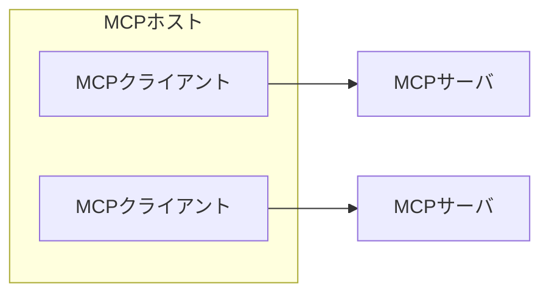

# Software Design 202509

## MCPで変わるLLMアプリ開発

**MCPサーバ**はローカルMCPとリモートMCPがある。後者も少しずつ普及している。
MCPサーバとのMCPクライアント間の通信は、stdioでやる場合とStreamable HTTPでやる場合がある。

**MCPホスト**とは、多くの場合、Claude DesktopのようなAIエージェントである。
MCPホストの中で、MCPサーバへの接続を行うのが**MCPクライアント**。

サーバ側の機能には3つがある。

- **プロンプト** - 事前定義されたテンプレート化された指示文
- **リソース** - MCPサーバが提供する、読み取り専用のデータ
- **ツール** - 本丸。外部からの情報取得や、他のシステムの操作などを行う

クライアント側の機能には以下の3つがあるが、普及はこれから。

- **ルート** - アクセス可能なリソース範囲の定義
- **サンプリング** - MCPホスト側のLLMを借用
- **エリシテーション** - ユーザーから追加情報を引き出す

**MCPホスト**、つまりMCPサーバを利用する側のAIエージェントも、実は結構簡単に開発できる。
TSだと[Mastra](https://github.com/mastra-ai/mastra)が新進気鋭。
Pythonだと LangGraph や Strands Agents などがある。

## 文字コード

- **字種**とは、音と意味の組み合わせ。
- **字体**とは、形のこと。
- **字形**とは、デザイン差のこと。

例えば`国`と`國`なら、音と意味は同じで、形は違う。よって、字種は同じで、字体が異なる。
一方、字形が違うというのは、フォントによる差異などである。

**異体字**とは、字種が同じだが、正式な規範から外れた文字のこと。

**符号化文字集合** とは、コンピューターで文字を扱うために、
あらかじめどの文字を扱うか決めた範囲のこと。

- ISO/IEC 10646
  - Unicodeとほぼ互換だが、Unicodeは国際規格ではなくフォーラム規格である
  - 日本工業規格版が JIS X 0221
- JIS X 0201 (1963年策定)
- JIS X 0208:1983(JIS83)
- JIS X 0213:2000(JIS2000)
- JIS X 0213:2004(JIS2004)

**文字符号化方式** は、具体的な符号化のやり方のこと。
ShiftJIS, EUC, UTF-8, UTF-16など。
UTF-16はアプリケーション内部で、UTF-8はネットワークを通じた交換(HTTP/JSON)などで主に使われる。

**外字** とは、JIS X 0213やUnicodeに含まれていない、規格化されていない文字のこと。
システム間で共有できない、互換性のない文字と言える。

**Unicode Ideographic Variation Database (IVD)** は、
外字問題を標準的な仕組みで解決するために作成された、字形を管理するためのデータベース。
**Unicode Ideographic Variation Selector (IVS)** は、
Unicode IVDで管理されている字形を指定するための仕組み。
例えば「邉」はJIS X 0213では1つしか登録されていないが、IVD/IVSではたくさん登録されている。

## ドメイン解体新書 / Public Suffix List

**eTLD（Effective Top-Level Domain）** は、.comや.co.jpのように、
一般的に個人や組織が直接登録することができないドメインの部分を指す。

ブラウザは、eTLDに対してセキュリティポリシーを適用することはない。
ポリシーとは、例えばSameSiteの判定（「このドメインに属するサブドメインは全て同一オリジンとして扱う」）などだ。

一方、**eTLD+1** は「レジストラブルドメイン」と呼ばれ、これがブラウザのセキュリティポリシーを適用する最小単位となる。
例えば、my-company.comやmy-company.co.jpなどがeTLD+1に該当する。

どの部分がeTLDなのかを判断するための基準が **Public Suffix List (PSL)** である。
これは、ドメインを客に払い出すサービスなどをしている場合に特に重要となる。
Cookieの共有範囲制御や、ワイルドカードSSL証明書の管理などに影響するからだ。

2025/9時点で15,000行強、300KB程度あるので、ブラウザにハードコードされたりキャッシュされたりしている。
以下のGitHubで管理されている。
[https://github.com/publicsuffix/list](https://github.com/publicsuffix/list)

- `example.com`と書くと、example.comがeTLDになる。
- `*.example.com`と書くと、以下の全てがeTLDになる
  - test1.example.com
  - test2.example.com
  - ....(その他すべて)
- `!www.example.com`と書くと、www.example.comだけをeTLDから除外する。
  結果として何がeTLDになるかは他の行の設定に依存する。

## つまみぐい関数型プログラミング / 高階関数

**高階関数 / Higher-order function** とは、関数を受け取ったり返したりする関数のこと。
関数がファーストクラスオブジェクトである(値と同じ用に扱える)場合に使える。
関数は値から値への変換を行う。その「値」に「関数」も含まれているということ。

**関数を受け取る関数**には、filter, map, reduceなどがある。
複雑な処理を複数の単純な関数に分けられるため、
入れ替えや変更の容易性、再利用性が高くなる。

**関数を返す関数(カリー化+部分適用)** を使うと、あらかじめ設定を焼き込んだ関数を生成できる。
主に Dependency Injection や、処理のバリエーションを簡素に表現するために使う。
