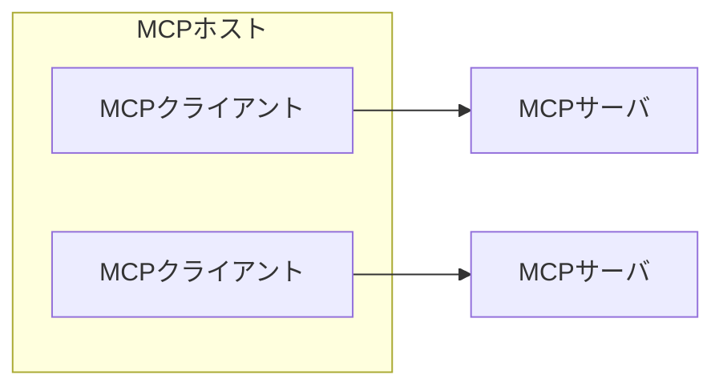

# Software Design 202509

## MCPで変わるLLMアプリ開発

**MCPサーバ**はローカルMCPとリモートMCPがある。後者も少しずつ普及している。
MCPサーバとのMCPクライアント間の通信は、stdioでやる場合とStreamable HTTPでやる場合がある。

**MCPホスト**とは、多くの場合、Claude DesktopのようなAIエージェントである。
MCPホストの中で、MCPサーバへの接続を行うのが**MCPクライアント**。

サーバ側の機能には3つがある。

- **プロンプト** - 事前定義されたテンプレート化された指示文
- **リソース** - MCPサーバが提供する、読み取り専用のデータ
- **ツール** - 本丸。外部からの情報取得や、他のシステムの操作などを行う

クライアント側の機能には以下の3つがあるが、普及はこれから。

- **ルート** - アクセス可能なリソース範囲の定義
- **サンプリング** - MCPホスト側のLLMを借用
- **エリシテーション** - ユーザーから追加情報を引き出す

**MCPホスト**はライブラリを用いることで比較的簡単に開発できる。
TSだと[Mastra](https://github.com/mastra-ai/mastra)が新進気鋭。
Pythonだと LangGraph や Strands Agents などがある。

## 文字コード

### 文字コードの基礎

- **字種**とは、音と意味の組み合わせ。
- **字体**とは、形のこと。
- **字形**とは、デザイン差のこと。

例えば`国`と`國`なら、音と意味は同じで、形は違う。よって、字種は同じで、字体が異なる。
一方、字形が違うというのは、フォントによる差異などである。

**異体字**とは、字種が同じだが、規範となる**正字**から外れた字形をもつ字のこと。
何が正字かはコンテキストによる。

**符号化文字集合** とは、コンピューターで文字を扱うために、
あらかじめどの文字を扱うか決めた範囲のこと。

- ISO/IEC 10646
  - Unicodeとほぼ互換だが、Unicodeは国際規格ではなくフォーラム規格である
  - 日本工業規格版が JIS X 0221
- JIS X 0201 (1963年策定)
- JIS X 0208:1983(JIS83)
- JIS X 0213:2000(JIS2000)
- JIS X 0213:2004(JIS2004)

**文字符号化方式** は、具体的な符号化のやり方のこと。
ShiftJIS, EUC, UTF-8, UTF-16など。
UTF-16はアプリケーション内部で、UTF-8はネットワークを通じた交換(HTTP/JSON)などで主に使われる。

**外字** とは、コンピュータで扱う標準的な文字セット(JIS X 0213やUnicode)に含まれていない文字のこと。
システム間で共有できない、その環境固有の、互換性のない文字と言える。
多くの異体字を扱うために、やむなく外字が使われてきた歴史がある。

**Unicode Ideographic Variation Database (IVD)** は、
異体字問題・外字問題を標準的な仕組みで解決するために作成された、字形を管理するためのデータベース。
**Unicode Ideographic Variation Selector (IVS)** は、
Unicode IVDで管理されている字形を指定するための仕組み。

例えば「邉」はJIS X 0213では1つしか登録されていないが、IVD/IVSではたくさん登録されている。

### データベースと文字コード

いまはUTF-8に統一されているので問題が起こることはあまりない。
しかし、MySQLだけは注意。`utf8mb3`やそのエイリアスである`utf8`だと、
UTF-8の3バイト目までしか扱えず、一部の絵文字が化ける。`utf8mb4`をキッチリ指定すること。

並べ替えの規則を**コレーション**という。
常に文字コード順で並べ変わるわけではなく、RDBの設定に依存する。
RDBのカラムごとに設定ができる。

**MySQLの場合** は基本的にUnicode v9(古い)の規定に従い、実行環境には依存しない。
e.g. `utf8mb4_0900_(ai_ci|as_ci|as_cs|bin)`など。
`0900`はunicodeのバージョン、`a`はAccent, `c`はCase,`i`はInsensitive, `s`はSentitiveの意味。
`bin`だと文字コード順なので最も厳格。
設定によっては同じ並び順になる文字が複数存在することになり、ランダムに並び替わるので注意。

**Postgresの場合** は、デフォルトではOSのコレーション設定に依存する。
e.g. `C`(文字コード順),`ja_JP.utf8`(unicodeの規則に似ているがOS依存)など。
ICU（International Components for Unicode）ライブラリを使えば、
Unicode v16(最新)を用いたより高度なコレーションも使える。
MySQLと異なりPostgresではコードポイント順に並ぶ。

unicode規則による並び替えは **文字列全体で判定される**。
「基底文字列+アクセント情報(大文字小文字)+その他装飾情報」というソートキーが使われるからだ。
結果として、aaa->AAA->abc->ABC という順になる。

コレーションは **文字列の一致** にも影響する。
ソート順が同じなら同じ文字列であると判断されるからだ。
ただし、Postgresの場合はソート順だけでなく、最終的にコードポイントでも判定が入るので、
異なる文字が同じ文字と判定されることはない。

**文字列のカウント** にも注意が必要だ。
Unicodeの1つのコードポイントは、UTF-8で1-4バイトで表現される。
RDBには、バイト単位で数える関数と、コードポイント単位で数える関数があるので注意する。
さらに、人間には1つの文字に見える(**書記素**という)が、実際には複数のコードポイントからなる文字もある。
書記素単位でのカウントはPostgresではできない。MySQLでは`\X`という正規表現を使えばできなくもない。

**日本語用のコレーション** も用意されている。
`utf8mb4_ja_0900_as_cs`(MySQL)や`ja-x-icu`(Postgres)などだ。
JIS第一水準の漢字が50音順で並んだり、長音記号の並び順が自然になるメリットがある。

## ドメイン解体新書 / Public Suffix List

**eTLD（Effective Top-Level Domain）** は、`.com`や`.co.jp`のように、
一般的に個人や組織が直接登録することができないドメインの部分を指す。

一方、**eTLD+1** は「レジストラブルドメイン」と呼ばれる。
例えば、`my-company.com`や`my-company.co.jp`などがeTLD+1に該当する。

eTLD+1はセキュリティを扱うときの最小単位になる。
具体的には、ワイルドカードSSL証明書の利用が認められたり、ブラウザがSameSiteを判定するときの単位となることができる。
eTLDに対してそれらが適用されることはない。

どの部分がeTLDなのかを判断するための基準が **Public Suffix List (PSL)** である。
PSLは、ドメインを客に払い出すサービスなどをしている場合に特に重要となる。

2025/9時点で15,000行強、300KB程度あるので、ブラウザにハードコードされたりキャッシュされたりしている。
[GitHubで管理](https://github.com/publicsuffix/list)されている。

- `example.com`と書くと、example.comがeTLDになる。
- `*.example.com`と書くと、以下の全てがeTLDになる
  - test1.example.com
  - test2.example.com
  - ....(その他すべて)
- `!www.example.com`と書くと、それをeTLDから除外する。
  結果として何がeTLDになるかは他の行の設定に依存する。

## つまみぐい関数型プログラミング / 高階関数

**高階関数 / Higher-order function** とは、関数を受け取ったり返したりする関数のこと。
関数がファーストクラスオブジェクトである(値と同じ用に扱える)場合に使える。
関数は値から値への変換を行う。その「値」に「関数」も含まれているということ。

**関数を受け取る関数**には、TypeScriptでいうとfilter, map, reduceなどがある。
複雑な処理を複数の単純な関数に分けられるため、
入れ替えや変更の容易性、再利用性が高くなる。

**関数を返す関数(カリー化+部分適用)** を使うと、あらかじめ設定を焼き込んだ関数を生成できる。
主に Dependency Injection や、処理のバリエーションを簡素に表現するために使う。
